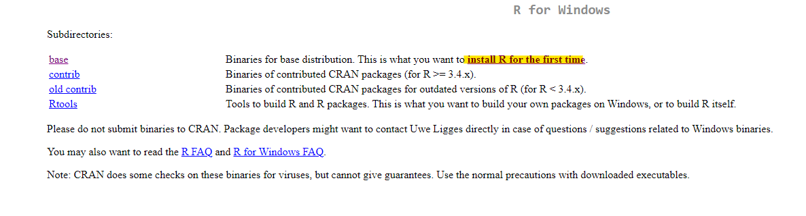
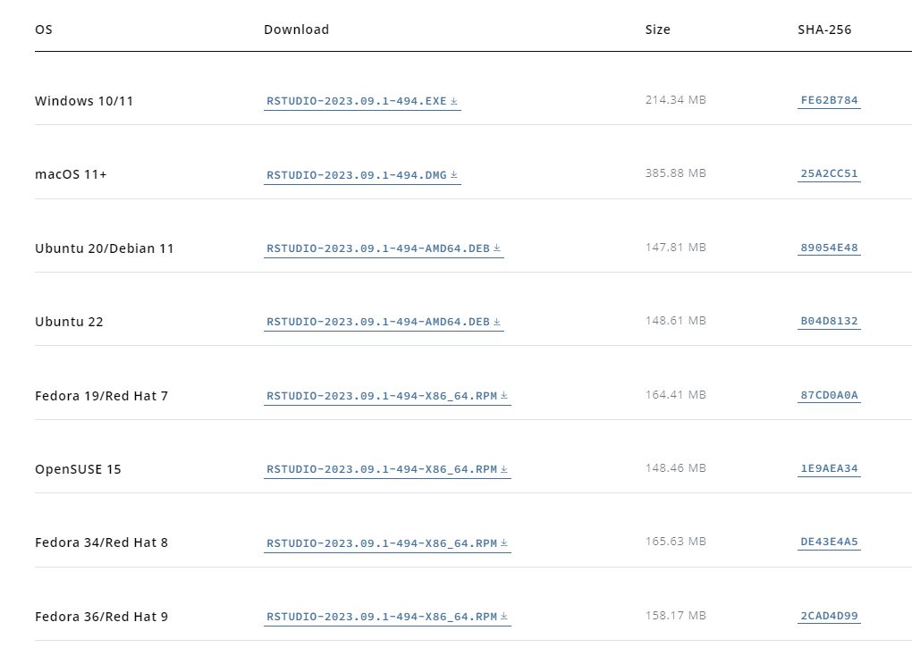

```{r setup, include=FALSE}
knitr::opts_chunk$set(echo = TRUE)
```

*¡Bienvenidos al Curso de R: Análisis de Datos y Visualización!* R es un
lenguaje de programación ampliamente utilizado en la ciencia de datos,
estadísticas y análisis de datos, y a lo largo de este curso, adquirirás
las habilidades esenciales para convertirte en un experto en el manejo y
análisis de datos

Podes acceder al repositorio
[acá](https://github.com/ariibard/aprendiendoR)

# Instalación de R, RStudio y Git

### Instalación de R

Para descargar R y Rstudio, debes acceder a la página
[Posit](https://posit.co/download/rstudio-desktop/).


Seleccionar el paso 1, que te llevara a la [página de
CRAN](https://cran.rstudio.com/) (Comprehensive R Archive Network) que
es el repositorio central de software de R. Allí, deberás seleccionar el
sistema operativo que utilices.

Luego deberás seleccionar el "install for the first time" (Instalar por
primera vez) en la parte superior de la página:



### Instalación de R Studio

Una vez que lo descargas, deberás ejecutar el .exe y seguir los pasos de
la instalación. La última versión de R es la 4.2.1. En cuanto hayas
descargado R, deberás descargar RStudio que es el IDE que estaremos
usando a lo largo del curso.

Para ello vuelve a la [página de
posit](https://posit.co/download/rstudio-desktop/) y selecciona el Paso
2. También podés seleccionar la opción de descarga que mejor se adapte a
tu sistema operativo



### Instalacion de Git

Para instalar git tenes que ingresar
[acá](https://git-scm.com/downloads) y seleccionar la opcion que mejor
se adapta a tu sistema operativo


¡Felicidades! Ahora tienes R, RStudio y Git instalados en tu compu. En
caso de tener algún inconveniente no dudes en escribirnos.

# Clase 1 - Introducción a R

En esta primera clase, exploraremos los conceptos básicos de R, un
lenguaje de programación y entorno de análisis de datos ampliamente
utilizado en la ciencia de datos y la estadística. Aprenderemos cómo
instalar R y RStudio, clonaremos un repositorio en Git y realizaremos
algunas operaciones básicas en R.

Ahora que tenemos R y RStudio instalados, podemos comenzar a explorar R.
Aquí hay algunos conceptos básicos:

## ¿Qué es R?

R es un lenguaje de programación y entorno de análisis de datos
ampliamente utilizado en la ciencia de datos, la estadística y la
investigación. Es de código abierto y ofrece una amplia variedad de
paquetes y bibliotecas que facilitan el análisis y la visualización de
datos

## Entorno de Trabajo de RStudio

Después de instalar R y RStudio, abriremos RStudio y exploraremos su
entorno de trabajo, que consta de cuatro paneles principales:

1.  **Script**: Donde podes escribir y guardar tu código R.
2.  **Console**: Donde podes ejecutar comandos de R directamente.
3.  **Environment**: Muestra las variables y objetos en tu espacio de
    trabajo.
4.  **Plots/Files/Packages/Help**: Paneles para gestionar gráficos,
    archivos, paquetes y obtener ayuda.

## Proyectos

En R, un proyecto es una estructura organizada que permite trabajar de
manera eficiente porque crea una carpeta donde se alojan todos los
archivos que vamos a utilizar en nuestro trabajo.

Para crear un proyecto en R, podes seguir estos pasos en RStudio:

1.  Abre RStudio.

2.  Ve a "File" (Archivo) en la barra de menú y selecciona "New Project"
    (Nuevo Proyecto).

3.  Elige la opción "New Directory" (Nuevo Directorio) si estás creando
    un nuevo proyecto desde cero o "Existing Directory" (Directorio
    Existente) si ya tienes un directorio existente que deseas convertir
    en un proyecto.

4.  Luego, podes especificar la ubicación del directorio y el nombre
    del proyecto.

5.  Haz clic en "Create Project" (Crear Proyecto) y se abrirá una nueva
    instancia de RStudio configurada para tu proyecto.

### ¿Cómo Clonar un Repositorio en Git? 

Clonar un repositorio en Git significa copiar un repositorio remoto
(generalmente alojado en GitHub o en otro servidor) en tu computadora
local. Esto te permite trabajar en una copia local de los archivos,
realizar cambios y contribuir al proyecto.

Pasos para clonar un repositorio en Git:

1.  Ve al menú "File" (Archivo) en la parte superior izquierda de la
    ventana de RStudio.

2.  Selecciona "New Project" (Nuevo Proyecto).

3.  En el cuadro de diálogo "New Project", elige "Version Control"
    (Control de Versiones).

4.  Luego, selecciona "Git".

5.  A continuación, pega la URL del repositorio Git que deseas clonar en
    el campo "Repository URL" (URL del Repositorio). Esta URL se
    encuentra en la página del repositorio en GitHub u otra plataforma
    de alojamiento de Git.

6.  En el campo "Project directory name" (Nombre del directorio del
    proyecto), podes especificar el nombre de la carpeta local donde se
    clonará el repositorio. Por defecto, RStudio utilizará el nombre del
    repositorio.

7.  Haz clic en "Create Project" (Crear Proyecto).

## Orientación a Objetos en R

R es un lenguaje orientado a objetos, lo que significa que todo en R es
un objeto. Incluso los números, las funciones y los datos son objetos en
R.

## Crear un "Chunk" en R Markdown

Un "chunk" es un bloque de código R que podes ejecutar en un documento
R Markdown. podes insertar un chunk utilizando tres comillas invertidas
y la etiqueta `{r}` o con ctrl+alt+i . Por ejemplo:

```{r}
# Esto es un chunk de código R
x <- 5
y <- 10
z <- x + y
z
```

## Operaciones Básicas en R

A continuación, realizaremos algunas operaciones básicas en R:

### Asignación de Variables

```{r}
# Esto es un comentario en R
x <- 5 # Asignación de un valor a una variable
y <- 10
```

### Operaciones matemáticas

R es como una calculadora

```{r}
# Suma de variables
z <- x + y
print(paste("La suma de x y y es:", z))
```

### Vectores

En R, un vector es una estructura de datos que almacena una secuencia de
valores del mismo tipo. podes crear un vector utilizando la función
`c()`.

```{r}
# Crear un vector
mi_vector <- c(1, 2, 3, 4, 5)

# Calcular la suma de los elementos en el vector
suma <- sum(mi_vector)

# Calcular la media
media <- mean(mi_vector)

cat("Suma: ", suma, "\n")
cat("Media: ", media, "\n")
```

## Operadores en R

R ofrece varios tipos de operadores:

-   **Asignación**: Se utiliza para asignar valores a variables. El
    operador más común es `<-`.

-   **Operadores Aritméticos**: Se utilizan para realizar operaciones
    matemáticas, como `+`, `-`, `*`, `/`, entre otros.

-   **Operadores Lógicos**: Se utilizan para evaluar condiciones
    lógicas, como `&&`, `||`, `!`.

-   **Operadores Relacionales**: Se utilizan para comparar valores, como
    `==`, `!=`, `>`, `<`.

## Tipos de Objetos en R

R tiene varios tipos de objetos, incluyendo:

-   **Numeric**: Números, por ejemplo, `3.14`.

```{r}
# Crear un objeto numeric
numero <- 3.14
class(numero)  # Verificar el tipo de objeto (numeric)
```

-   **Character**: Cadenas de texto, por ejemplo, `"Hola, R"`.

```{r}
# Crear un objeto character
texto <- "Hola, R"
class(texto)  # Verificar el tipo de objeto (character)
```

-   **Logical**: Valores lógicos, `TRUE` o `FALSE`.

```{r}
# Crear un objeto logical
verdadero <- TRUE
falso <- FALSE
class(verdadero)  # Verificar el tipo de objeto (logical)
```

-   **Integer**: Números enteros, por ejemplo, `2L`.

```{r}
# Crear un objeto integer
entero <- 2L
class(entero)  # Verificar el tipo de objeto (integer)
```

Ahora, mostraremos cómo convertir entre estos tipos de objetos
utilizando las funciones as.numeric, as.character y as.logical:

**Conversión a Numeric**

```{r}
# Convertir character a numeric
texto <- "123.45"
numero <- as.numeric(texto)
class(numero)  # Verificar el tipo de objeto (numeric)
```

**Conversión a Character**

```{r}
# Convertir numeric a character
numero <- 123.45
texto <- as.character(numero)
class(texto)  # Verificar el tipo de objeto (character)
```

**Conversion a logical**

```{r}
# Convertir numeric a logical
numero <- 0  # 0 se convierte en FALSE, cualquier otro número se convierte en TRUE
logico <- as.logical(numero)
class(logico)  # Verificar el tipo de objeto (logical)
```

## Funciones en R

Lo que vimos recién, `as.factor()` y `as.character()` son funciones. Las
funciones son bloques de código reutilizables que realizan tareas
específicas. R tiene muchas funciones incorporadas y también podes
crear las tuyas propias.

#### Suma

```{r}
# Función para sumar números
suma_resultado <- sum(1, 2, 3, 4, 5)
suma_resultado
```

#### Media

```{r}
# Función para calcular la media
vector <- c(1, 2, 3, 4, 5)
media_resultado <- mean(vector)
media_resultado
```

## Librerías en R

Las Librerías (o paquetes) en R son conjuntos de funciones y datos
adicionales que extienden las capacidades de R. Podes instalar y cargar
bibliotecas para acceder a funcionalidades adicionales.

Para instalar una biblioteca, utiliza la función
`install.packages("nombre_del_paquete")`. Para cargar una biblioteca,
utiliza `library(nombre_del_paquete)`.

```{r}
#install.packages("tidyverse")
library(tidyverse)
```

## Práctica

1.  Crear dos objetos y asignarles: a uno nombres y a otro edad

```{r}
# consigna 1
```

2.  Para las dos variables creadas en el punto anterior, verificar la
    clase o el tipo de objeto:

```{r}
# consigna 2
```

3.  Convertir el objeto nombres en uno de tipo numérico. ¿Qué sucede?

```{r}
# consigna 3
```
