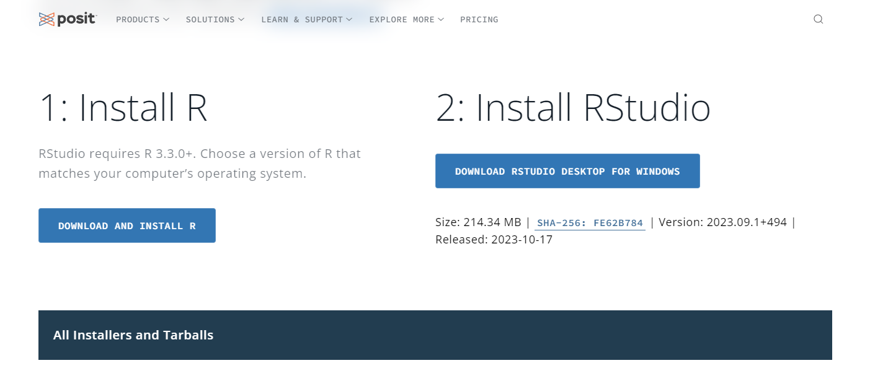
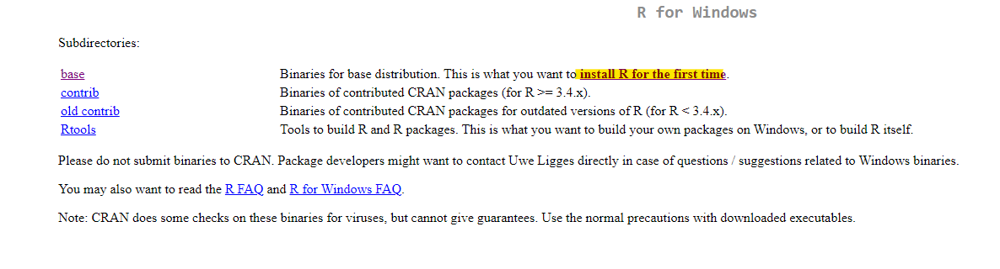
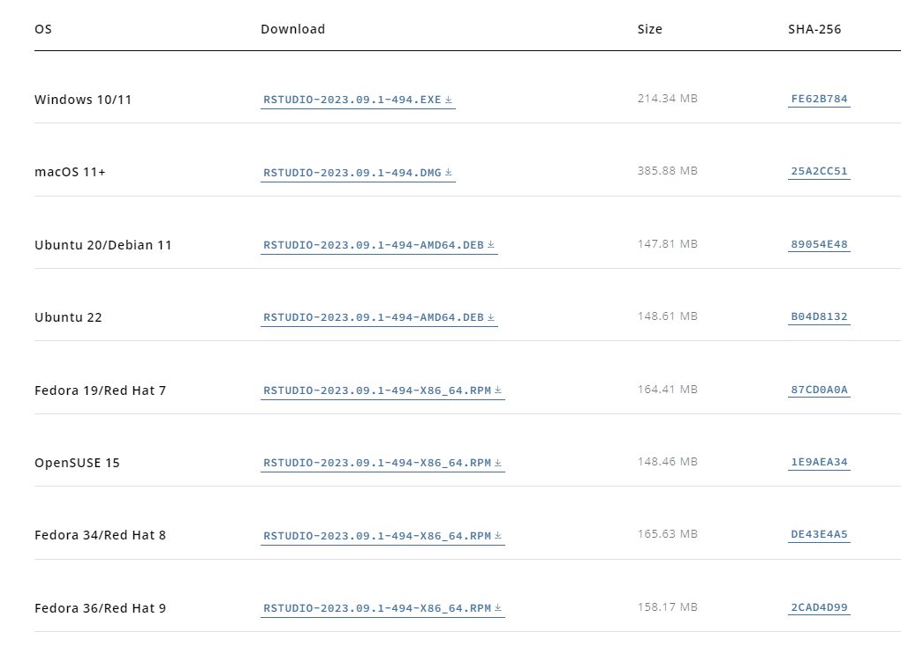

```{r setup, include=FALSE}
knitr::opts_chunk$set(echo = TRUE)
```

*¡Bienvenidos al Curso de R: Análisis de Datos y Visualización!* R es un
lenguaje de programación ampliamente utilizado en la ciencia de datos,
estadísticas y análisis de datos, y a lo largo de este curso, adquirirás
las habilidades esenciales para convertirte en un experto en el manejo y
análisis de datos

Podes acceder al repositorio
[acá](https://github.com/ariibard/aprendiendoR)

## Instalación de R y RStudio

#### Instalación de R

Para descargar R y Rstudio, debes acceder a la página
[Posit](https://posit.co/download/rstudio-desktop/).



Seleccionar el paso 1, que te llevara a la [página de
CRAN](https://cran.rstudio.com/) (Comprehensive R Archive Network) que
es el repositorio central de software de R. Allí, deberás seleccionar el
sistema operativo que utilices.

Luego deberás seleccionar el "install for the first time" (Instalar por
primera vez) en la parte superior de la página:



#### Instalación de R Studio

Una vez que lo descargas, deberás ejecutar el .exe y seguir los pasos de
la instalación. La última versión de R es la 4.2.1. En cuanto hayas
descargado R, deberás descargar RStudio que es el IDE que estaremos
usando a lo largo del curso.

Para ello vuelve a la [página de
posit](https://posit.co/download/rstudio-desktop/) y selecciona el Paso
2. También podés seleccionar la opción de descarga que mejor se adapte a
tu sistema operativo



## Instalacion de Git 

Para instalar git tenes que ingresar
[acá](https://git-scm.com/downloads) y seleccionar la opcion que mejor
se adapta a tu sistema operativo


¡Felicidades! Ahora tienes R, RStudio y Git instalados en tu compu. En
caso de tener algún inconveniente no dudes en escribirnos.
